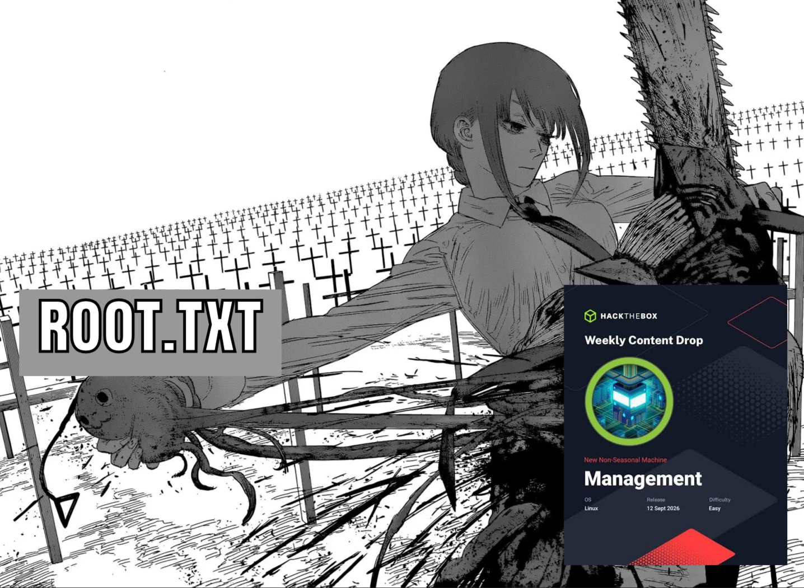
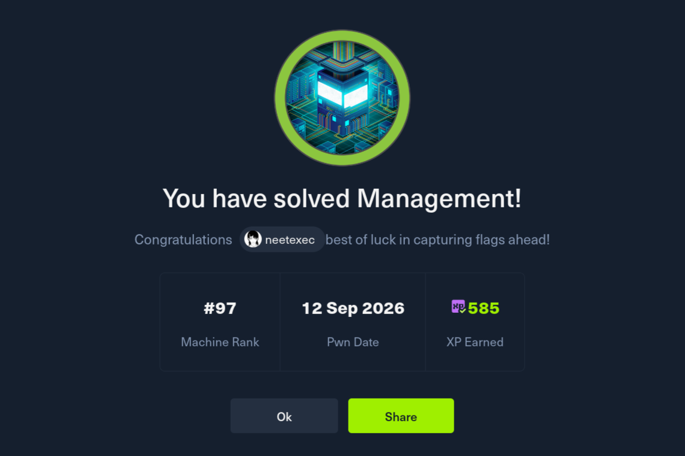

<p align="center">
  
</p>

<h1 align="center">Makima: Multi-Agent Autonomous Pentesting Orchestration System</h1>

<p align="center">
  Knowledge(cheatsheet)-driven multi-agent orchestration system for autonomous penetration testing.
</p>

<p align="center">
  <b>Powered by :</b><br><br>
  <a href="https://github.com/ThePorgs/Exegol"></a>&nbsp;
  <a href="https://opencode.ai"></a>&nbsp;
  <a href="https://herdr.dev"></a>
</p>

<p align="center">
  <a href="https://www.thehacker.recipes/"></a>
  <a href="https://github.com/swisskyrepo/PayloadsAllTheThings"></a>
  <a href="https://github.com/swisskyrepo/InternalAllTheThings"></a>
  <a href="https://github.com/jakobfriedl/precompiled-binaries"></a>
</p>

---

## Overview

Makima is a **Multi-Agent Autonomous Pentesting Orchestration System** built on top of [Exegol](https://github.com/ThePorgs/Exegol) container.

It uses **OpenCode as the AI harness** and **Herdr as the workspace/session environment** where Makima and other agents operate.

Makima acts as the **orchestrator**. She can spawn, control and coordinate specialized agents based on the current target, findings, and task requirements. Instead of relying on a single general-purpose agent, Makima uses multiple specialized agents for different phase of penetration testing.

<p align="center">
  
</p>

The agents share a common workspace and knowledge base, allowing the attack path to evolve as new information is discovered.

---

## Architecture

Makima uses specialized agents rather than putting every pentesting capability into a single agent.

```text
Exegol - Pentest Environment
│   pentest tools · precompiled binaries · knowledge base
│
└── Herdr - Workspace / Sessions
    │
    └── OpenCode - AI Harness
        │
        └── Makima - Orchestrator ──► Target
            │
            │  spawn / coordinate other agents
            │
            ├── recon
            ├── web-recon
            ├── web-exploit
            ├── cve-research
            ├── ad-enum
            ├── ad-exploit
            ├── linux-privesc
            ├── windows-privesc
            └── persistence
```

### Components

| Component | Role |
| --------- | ---- |
| **Makima** | Main orchestrator responsible for spawning and coordinating agents |
| **Agents** | Specialized AI workers for specific pentesting tasks |
| **Skills** | Reusable operational knowledge and capabilities available to agents |
| **Knowledge Base** | Local offensive-security cheatsheet / references used by the agents |
| **Precompiled Binaries** | Ready-to-use, precompiled Windows/AD binaries (e.g. SharpHound) |
| **OpenCode** | AI harness through which agents interact with the environment |
| **Herdr** | Workspace and session layer used to manage agent execution |
| **Exegol** | Pentest environment containing the pentesting tools and resources |

---

### Agents

Each agent focuses on a specific area of penetration testing.

| Agent | Description |
| ----- | ----------- |
| **makima** | Main orchestrator; spawns, delegates, and coordinates other agents |
| **recon** | Port, service, and OS enumeration |
| **web-recon** | Web attack-surface discovery: technologies, virtual hosts, directories, parameters, and CMS |
| **web-exploit** | Web exploitation: SQLi, SSTI, SSRF, XXE, LFI, file upload, JWT, and related techniques |
| **cve-research** | CVE and vulnerability research, exploit discovery, and exploitability verification |
| **ad-enum** | Active Directory enumeration: users, groups, ACLs, Kerberos roasting, and domain relationships |
| **ad-exploit** | AD exploitation and lateral movement: relay, delegation, ADCS, tickets, and credential abuse |
| **linux-privesc** | Linux local enumeration and privilege escalation to root |
| **windows-privesc** | Windows local enumeration and privilege escalation to SYSTEM/Administrator |
| **persistence** | Shell handling, TTY stabilization, persistence, and pivoting |

### Skills

Skills provide reusable knowledge and procedures that can be used by multiple agents.

| Skill | Description |
| ----- | ----------- |
| **htb-methodology** | End-to-end HTB methodology, flag conventions, and note discipline |
| **herdr** | Base Herdr CLI usage: panes, tabs, and agent sessions |
| **herdr-orchestration** | Makima conventions for spawning and coordinating agents |
| **knowledgebase** | How to navigate and use the local knowledge base |
| **toolbox** | Locations of tools, binaries, webshells, wordlists, and other resources |
| **shell** | Reverse shells, bind shells, TTY upgrades, and file transfer |
| **cracking** | Hash cracking workflows using Hashcat, John, and related tools |
| **pivoting** | Pivoting and tunneling using Chisel, Ligolo, SOCKS, and related techniques |

### Directory layout

```
/workspace/
├── AGENTS.md                  # engagement & orchestration conventions
├── README.md
├── .opencode/
│   ├── opencode.json          # config + references to the knowledgebase
│   ├── agent/                 # 10 agent prompts (makima + 9 sub-agents)
│   ├── command/               # /solve, /status
│   └── skill/                 # cracking, shell, toolbox, herdr, etc.
├── knowledgebase/
│   ├── INDEX.md               # topic → file path map
│   ├── PayloadsAllTheThings/  # web/API payloads (SQLi, SSTI, SSRF, ...)
│   ├── InternalAllTheThings/  # AD, privesc, persistence, pivoting, C2
│   └── HackerRecipes/         # theory + walkthroughs (AD, web, infra)
├── precompiled-binaries/      # ready-to-use Windows/AD binaries
└── engagements/<box-name>/    # notes.md + recon/ loot/ exploits/ per machine
```

---

## Knowledge Base

Makima is built around offensive-security knowledge / cheatsheets from these repositories:

| Knowledge Base           | Focus                                                                 | Source |
| ------------------------ | --------------------------------------------------------------------- | ------ |
| **Hacker Recipes**       | General offensive-security techniques and methodology                 | [thehacker.recipes](https://www.thehacker.recipes/) |
| **PayloadsAllTheThings** | Payloads and exploitation techniques, especially for web applications | [swisskyrepo/PayloadsAllTheThings](https://github.com/swisskyrepo/PayloadsAllTheThings) |
| **InternalAllTheThings** | Active Directory and internal-network attack techniques               | [swisskyrepo/InternalAllTheThings](https://github.com/swisskyrepo/InternalAllTheThings) |

The KB provides agents with practical techniques, methodologies, payloads, checklists, and references that can be used during an engagement.

The knowledge base is **not intended to be a rigid playbook**. When the current scenario is not covered by the KB, agents can combine existing knowledge, reason from the evidence they have collected, use their own knowledge, or research additional information from the internet. This allows Makima to adapt to attack paths that aren't explicitly documented in the local knowledge base.

More knowledge sources can be added as the system evolves.

---

## Current Results

Makima has been built and tested against multiple **HackTheBox Easy-Medium machines**.

In several cases, Makima has been able to execute the attack chain autonomously from initial reconnaissance all the way to obtaining the root flag in around 1 hour.

<p align="center">
  
</p>

<p align="center">
  
</p>

Yeah, I know - that's still not fast enough.

Honestly, I wonder how people in the top ranks of HTB Seasonal can solve boxes in under 15 minutes. 🤔

The level of autonomy depends on the target and attack path. Some scenarios still require human steering, particularly when the target requires novel techniques, assumptions, or information outside the available knowledge base.

---

##  Installation

### Requirements

* Docker
* Exegol
* OpenCode
* Herdr

#### 1. Install Docker

<https://docs.docker.com/get-docker/>

#### 2. Install Exegol

<https://github.com/ThePorgs/Exegol>

#### 3. Install OpenCode & Herdr

Once Exegol is running, install both **inside the Exegol container**:

* OpenCode — <https://opencode.ai/docs/>
* Herdr — <https://herdr.dev> (install script: <https://herdr.dev/install.sh>)

#### 4. Add Makima & the Knowledge Base

Copy the entire contents of this repository into the Exegol workspace directory,
usually:

```text
~/.exegol/workspaces/<exegol-container-name>/
```

---

## Usage

1. Enter the Exegol shell and start **Herdr**.
2. In the first tab, name it `opencode` and run the **makima** agent there.
3. Start the engagement — either prompt Makima in plain language, or use the `/solve` command:

```text
/solve <target-ip> [additional info]
```

For example:

```text
/solve 10.10.X.X (Management, Linux, Easy)

pwn the machine
```

Or simply just talk to Makima. For example, tell her to spawn recon agent then do recon on the target.

```
do port scanning on 10.10.x.x. use recon agent.
```

Makima then runs: she opens new Herdr tabs and spawns the relevant specialized agents there, coordinating them until the task is completed.

```
User (/solve <ip>)
        │
        ▼
   ┌──────────┐        read/write context
   │  makima  │◄──────► /workspace/engagements/<box>/notes.md
   │(primary) │
   └────┬─────┘
        │ spawn sub-agents in ai-* tabs (parallel)
        ▼
 ┌──────────────────────────────────────────────────────────┐
 │  recon      web-recon    web-exploit   cve-research       │
 │  ad-enum    ad-exploit   linux-privesc windows-privesc    │
 │  persistence                                              │
 └──────────────────────────────────────────────────────────┘
        │
        ▼
   Knowledgebase + Skills + Toolbox (consulted on demand)
```

---

## How Makima Works

Makima is the **orchestrator**. She does not run thes scans or exploits herself, she plans, delegates, and verifies.

1. **Single source of truth** — every engagement lives in
   `engagements/<box>/notes.md`. Makima reads it before each phase, and every
   agent appends its findings under its own section so parallel work never
   overwrites another agent.
2. **Phase planning** — Makima breaks the target into phases: recon → analysis
   → foothold → privilege escalation → flags.
3. **Delegation** — for each phase she opens a new Herdr tab (`ai-<role>`) and
   spawns the matching specialized agent, handing it full context (target,
   creds, ports, prior findings).
4. **Parallel work** — independent agents (recon, web-recon, cve-research) run
   at the same time in their own tabs, and long jobs run in extra panes.
5. **Results via files** — agent terminal output is truncated (alternate
   screen), so Makima collects results from `notes.md`, not from the terminal.
6. **Adaptive routing** — she reads each result and decides the next move:
   web → `web-exploit`, AD → `ad-enum` / `ad-exploit`, a versioned service →
   `cve-research`. The path changes as new evidence appears.
7. **Flag verification** — a flag is recorded only after it is re-read from its
   file and matches the expected format.
8. **Human steering** — you can jump in at any time with extra context or a
   specific task, and Makima folds it into the current plan.

---

## Credits

Makima builds on community offensive-security knowledge bases and tool sets:

- [The Hacker Recipes](https://www.thehacker.recipes/) — general offensive-security techniques and methodology
- [PayloadsAllTheThings](https://github.com/swisskyrepo/PayloadsAllTheThings) — web/API payloads and exploitation techniques
- [InternalAllTheThings](https://github.com/swisskyrepo/InternalAllTheThings) — Active Directory and internal-network techniques
- [precompiled-binaries](https://github.com/jakobfriedl/precompiled-binaries) — precompiled Windows/AD binaries

---

## Disclaimer

**Do not use Makima against systems without authorization.**

The authors are not responsible for misuse or damage caused by this project.

---

<p align="center">
  <i>返事ははいかワンだけ。いいえなんて言う犬はいらない。</i>
</p>
